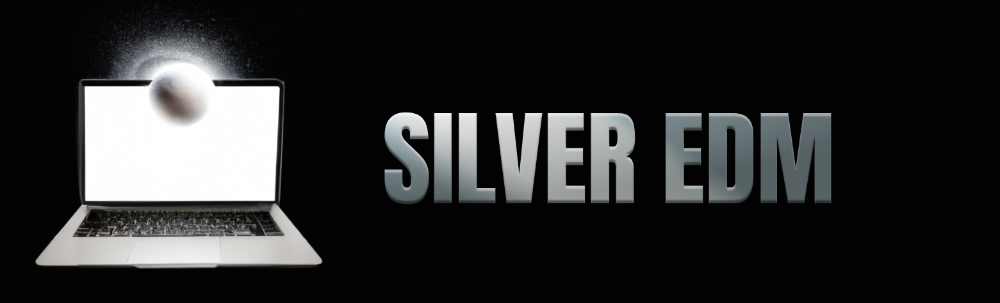

# Simple Implementation of Elucidating the Design Space of Diffusion-Based Generative Models (EDM)
Project base of Elucidating the Design Space of Diffusion-Based Generative Models (EDM)

[[Original Repo](https://github.com/NVlabs/edm#elucidating-the-design-space-of-diffusion-based-generative-models-edmofficial-pytorch-implementation-of-the-neurips-2022-paper)] [[Paper Link](https://arxiv.org/abs/2206.00364)]

## :gift: Userful for

This repogitory is implemented as a project base for the diffusion model. It can be used in the following situations :

- :white_check_mark: **No fine tuning resources for Stable Diffusion.**
- :white_check_mark: **Easy to setup for domain-specific tasks**
- :white_check_mark: **Easy to implement your own pretreatment process**

## :rocket: Easy setup

```
git clone https://github.com/galaxygliese/Silver-EDM
cd Silver-EDM
```

### Training:

Train simple diffusion model:

```
python3 train.py --epoch 100 --batchsize 512 --dataset_path /path/to/data/folder 
```

Train latent diffusion:

```
python3 train_ldm.py --epoch 100 --batchsize 512 --dataset_path /path/to/data/folder 
```

### Sampling:

Sampling:

```
python3 generate.py --checkpoint /path/to/checkpoint --sample_num 4
```

Sampling latent diffusion:

```
python3 generate_ldm.py --checkpoint /path/to/checkpoint --sample_num 4
```


## :hourglass_flowing_sand: Coming Soon...

- [Consistency Models](https://github.com/openai/consistency_models)
- [Transformer EDM](https://github.com/facebookresearch/DiT/tree/main)
- EDM for 1D and 3D datas
- [SDE-Edit](https://github.com/ermongroup/SDEdit)
- [Super Resolutions](https://github.com/Janspiry/Image-Super-Resolution-via-Iterative-Refinement)


## :bookmark_tabs: Citations
```
@inproceedings{Karras2022edm,
  author    = {Tero Karras and Miika Aittala and Timo Aila and Samuli Laine},
  title     = {Elucidating the Design Space of Diffusion-Based Generative Models},
  booktitle = {Proc. NeurIPS},
  year      = {2022}
}
```
